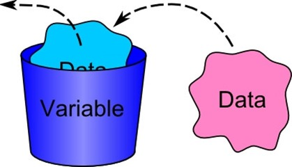
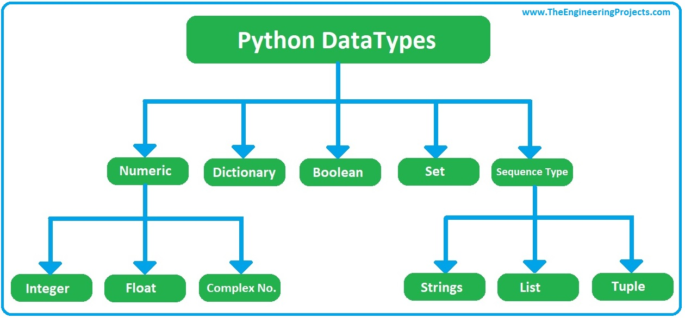
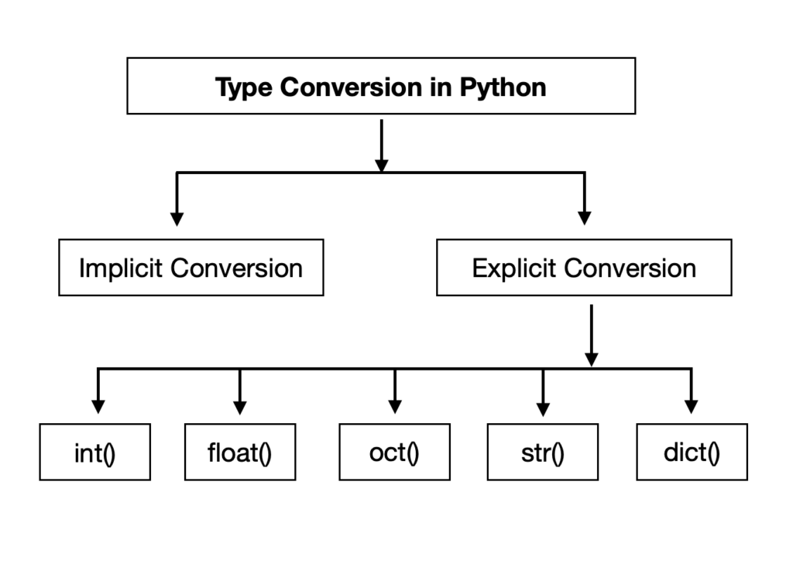
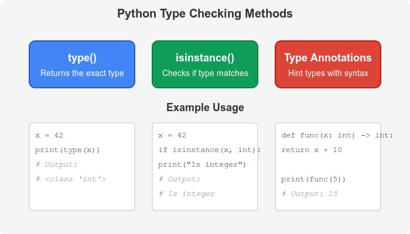
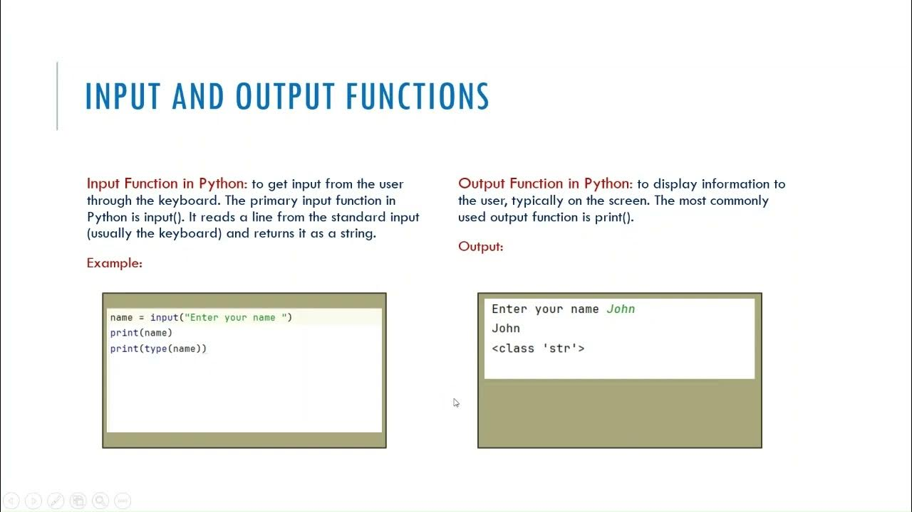
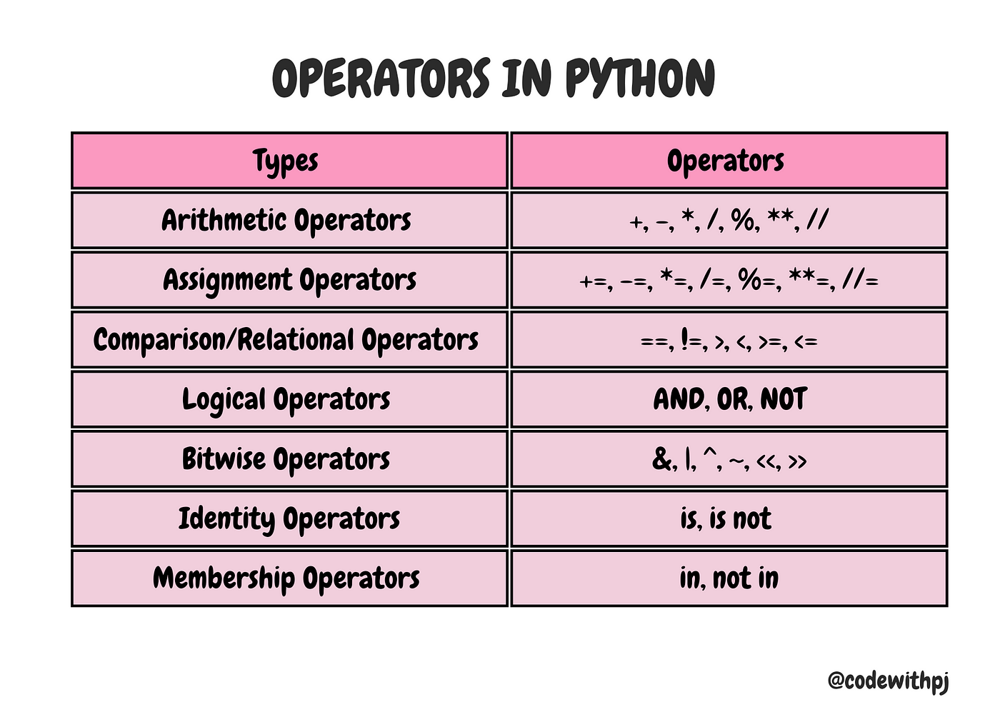

# 📢  Dot Net Learners House Meetup – Monthly Event - Apr 2025

## Date Time: 13-Apr-2025 at 04:00 PM IST

## Event URL: [https://www.meetup.com/dot-net-learners-house-hyderabad/events/306640169/](https://www.meetup.com/dot-net-learners-house-hyderabad/events/306640169/)


---


## **🎯 Goal of the Session**

By the end of this session, attendees will be able to:

- Understand how to declare and use variables in Python effectively.
- Identify and work with different built-in data types: `int`, `float`, `string`, and `bool`.
- Apply type checking and perform type casting using built-in functions like `type()`, `int()`, and `float()`.
- Use `input()` and `print()` functions to handle user interaction.
- Apply arithmetic, comparison, and logical operators for decision-making and calculations.

---

## *📝 Demo Script:*

### *Introduction (2 min)*

"Hey everyone! It's great to have you all here for this month’s session."

"Today, we’re going back to the very foundation of Python programming—the basic concepts that every Python developer needs to know."

"We’ll talk about variables, different data types, how to convert between them, and how to get inputs and show outputs using Python functions. And of course, we’ll wrap up with a look at Python’s basic operators."

"These are the building blocks of every Python project—so let’s get into it!"

---

## 📦 **Variables and Data Types**

Variables are the **named memory locations** that store values which can be used and modified later in a program. In Python, variable declaration is dynamic—you don't need to mention the data type explicitly.

### 🔹 Syntax:
```python
variable_name = value
```

Python automatically understands the type based on the assigned value.



### ✅ Examples:
```python
name = "Python"       # String
age = 25              # Integer
price = 19.99         # Float
is_online = True      # Boolean
```

### 🔍 More on Data Types:

- **int** – Whole numbers (`5`, `-20`)
- **float** – Decimal numbers (`5.5`, `-0.9`)
- **str** – Textual data (`"Hello"`, `'World'`)
- **bool** – Logical values (`True`, `False`)



### 🧪 You can check the type using:
```python
print(type(price))      # Output: <class 'float'>
```

You can also reassign variables to different types:
```python
price = "Twenty"
print(type(price))      # Now it's <class 'str'>
```

---

## 🔁 **Type Casting and Type Checking**

Type casting helps convert one data type into another.



### 🔄 Examples:

- String to Integer:
```python
num = "100"
converted = int(num)
print(converted + 50)     # Output: 150
```

- Integer to Float:
```python
val = 10
converted = float(val)
print(converted)          # Output: 10.0
```

- Float to String:
```python
pi = 3.14
converted = str(pi)
print("Value of pi is " + converted)
```

### ⚠️ Caution:
Be careful when casting:
```python
x = "abc"
# int(x) will cause an error: ValueError
```

Type checking with `type()` helps avoid such issues.

---




## 🖥️ **Input and Output Functions**

In Python, interaction with users is done using:




- `input()` → for taking input
- `print()` → for showing output

### 🔹 `input()` Always Returns a String
```python
name = input("Enter your name: ")
print("Welcome,", name)
```

### 🔹 Use `int()` or `float()` for numeric input:
```python
age = int(input("Enter your age: "))
print("Next year you will be", age + 1)
```

### 🔹 Using `print()` with f-strings:
```python
score = 98
print(f"Your final score is: {score}")
```

You can also print multiple items using commas:
```python
print("Hello", name, "you are", age, "years old.")
```

---

## ➕ **Basic Operators**

Operators perform operations on values and variables. Python supports a wide variety of them.

---



---

## 🔧 **Operators in Python**

Operators are special symbols used to perform operations on variables and values. Python supports several types of operators to handle different kinds of computations and logic.

---

### ➕ **Arithmetic Operators**

These are used for performing basic mathematical operations.

| Operator | Description       | Example     | Result |
|----------|-------------------|-------------|--------|
| `+`      | Addition           | `5 + 3`     | `8`    |
| `-`      | Subtraction        | `10 - 4`    | `6`    |
| `*`      | Multiplication     | `6 * 2`     | `12`   |
| `/`      | Division           | `8 / 2`     | `4.0`  |
| `%`      | Modulus            | `9 % 4`     | `1`    |
| `**`     | Exponentiation     | `2 ** 3`    | `8`    |
| `//`     | Floor Division     | `9 // 2`    | `4`    |

---

### 📝 **Assignment Operators**

These operators are used to assign values to variables. You can also combine them with arithmetic operators.

| Operator | Description           | Example       | Result       |
|----------|-----------------------|---------------|--------------|
| `=`      | Assign                | `x = 5`       | `x = 5`      |
| `+=`     | Add and assign        | `x += 3`      | `x = x + 3`  |
| `-=`     | Subtract and assign   | `x -= 2`      | `x = x - 2`  |
| `*=`     | Multiply and assign   | `x *= 4`      | `x = x * 4`  |
| `/=`     | Divide and assign     | `x /= 2`      | `x = x / 2`  |
| `%=`     | Modulus and assign    | `x %= 3`      | `x = x % 3`  |
| `**=`    | Exponent and assign   | `x **= 2`     | `x = x ** 2` |
| `//=`    | Floor divide and assign| `x //= 2`     | `x = x // 2` |

---

### 🔍 **Comparison (Relational) Operators**

Used to compare two values and return a Boolean result (`True` or `False`).

| Operator | Description       | Example      | Result   |
|----------|-------------------|--------------|----------|
| `==`     | Equal to           | `5 == 5`     | `True`   |
| `!=`     | Not equal to       | `5 != 3`     | `True`   |
| `>`      | Greater than       | `5 > 3`      | `True`   |
| `<`      | Less than          | `3 < 5`      | `True`   |
| `>=`     | Greater or equal   | `5 >= 5`     | `True`   |
| `<=`     | Less or equal      | `4 <= 5`     | `True`   |

---

### ⚙️ **Logical Operators**

Used to combine multiple conditions.

| Operator | Description                   | Example                      | Result  |
|----------|-------------------------------|------------------------------|---------|
| `and`    | True if both conditions are true | `5 > 3 and 8 > 6`         | `True`  |
| `or`     | True if at least one is true     | `5 < 3 or 8 > 6`           | `True`  |
| `not`    | Reverses the condition           | `not(5 > 3)`               | `False` |

---

### 🧠 **Bitwise Operators**

Operate on binary numbers (bits). Mostly used in low-level programming.

| Operator | Description          | Example     | Binary Operation        | Result |
|----------|----------------------|-------------|--------------------------|--------|
| `&`      | AND                  | `5 & 3`     | `101 & 011 = 001`        | `1`    |
| `|`      | OR                   | `5 | 3`     | `101 | 011 = 111`        | `7`    |
| `^`      | XOR                  | `5 ^ 3`     | `101 ^ 011 = 110`        | `6`    |
| `~`      | NOT (1’s complement) | `~5`        | `~0101 = 1010` (inverted)| `-6`   |
| `<<`     | Left Shift           | `5 << 1`    | `0101 → 1010`            | `10`   |
| `>>`     | Right Shift          | `5 >> 1`    | `0101 → 0010`            | `2`    |

---

### 🆔 **Identity Operators**

Used to compare memory locations of two objects.

| Operator   | Description                      | Example               | Result   |
|------------|----------------------------------|------------------------|----------|
| `is`       | True if both refer to same object| `x is y`               | `True/False` |
| `is not`   | True if not same object          | `x is not y`           | `True/False` |

🔎 Example:
```python
a = [1, 2]
b = a
c = [1, 2]

print(a is b)      # True (same memory)
print(a is c)      # False (same values, different objects)
```

---

### 📚 **Membership Operators**

Used to check if a value exists in a sequence (like a list, tuple, string, etc.).

| Operator   | Description                 | Example                   | Result  |
|------------|-----------------------------|----------------------------|---------|
| `in`       | True if value exists        | `'a' in 'apple'`           | `True`  |
| `not in`   | True if value doesn't exist | `'x' not in 'banana'`      | `True`  |

🔎 Example:
```python
fruits = ['apple', 'banana', 'mango']
print('apple' in fruits)         # True
print('orange' not in fruits)    # True
```

---

## 🔚 **Recap**

Let’s summarize what we’ve learned:

✅ **Variables** are used to store and reuse data.

✅ Python supports several **data types**: int, float, str, and bool.

✅ **Type casting** lets you convert one type into another safely.

✅ You can use **input()** to take user input and **print()** to display outputs.

✅ **Operators** help in building logic, performing calculations, and controlling program flow.

---

"That’s all for today’s session. We covered the building blocks of Python—from variables to operators—and how to use them to write interactive, logical programs."

"With these basics in place, you're ready to dive deeper into decision-making, loops, and eventually full Python applications!"

"Thanks for joining! Let’s now move on to some practical exercises to apply what we’ve covered."

---
